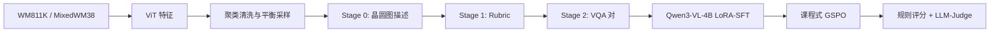
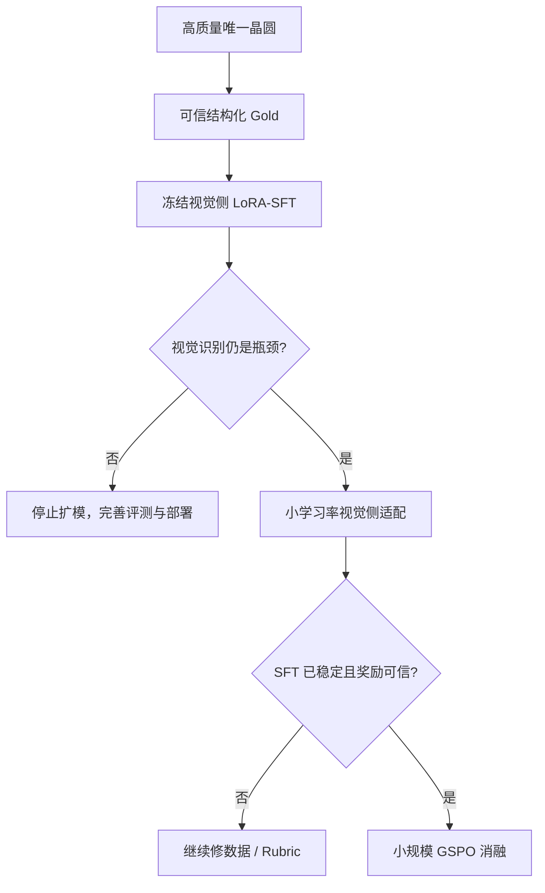
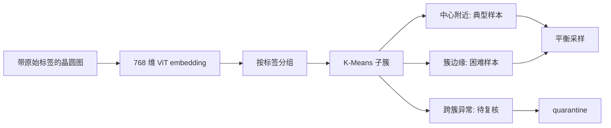
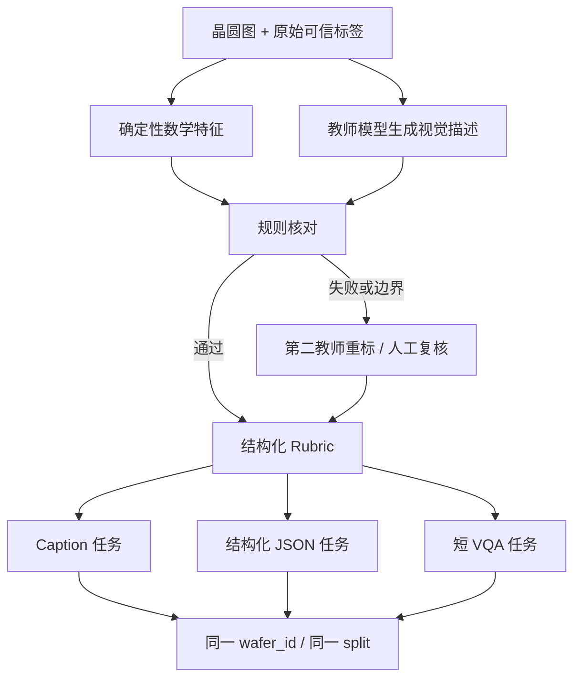
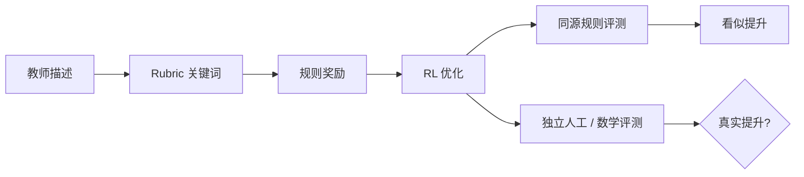
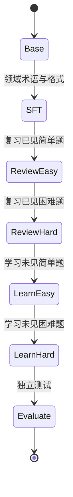
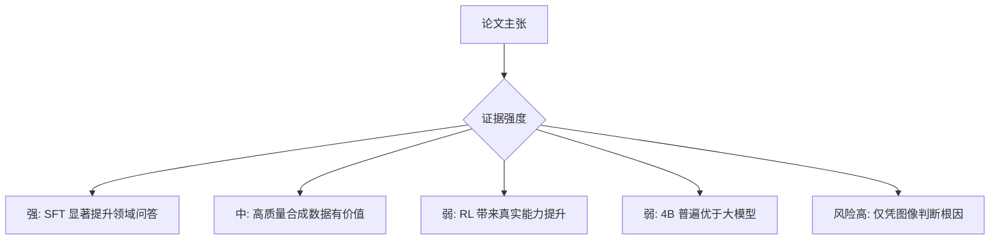
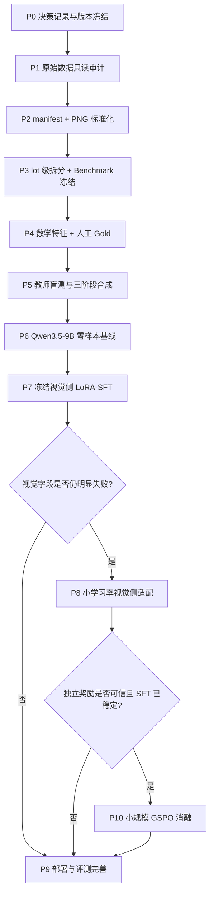
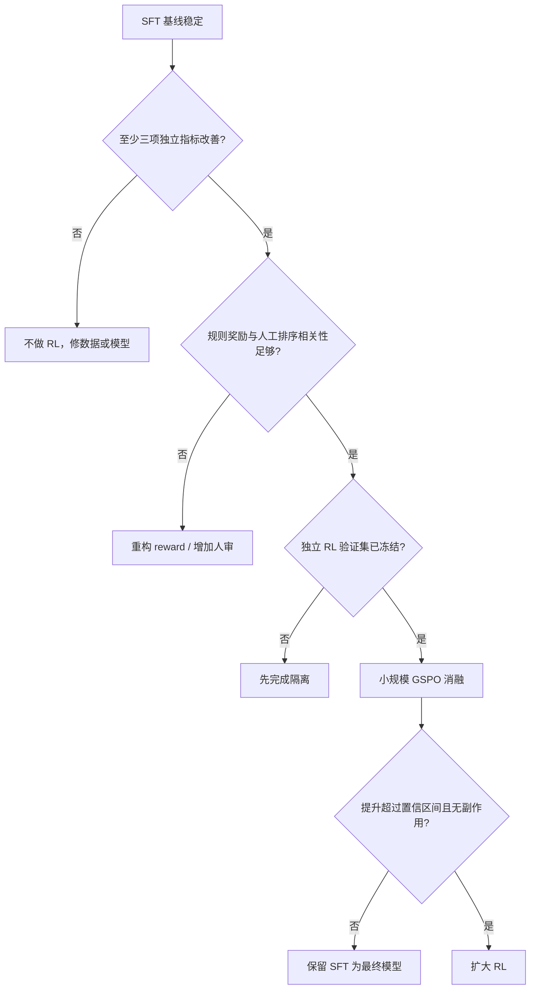

# 🎯 WaferSAGE 中文精读：从论文方法到 Qwen3.5-9B 晶圆图训练方案

> 论文：**WaferSAGE: Large Language Model-Powered Wafer Defect Analysis via Synthetic Data Generation and Rubric-Guided Reinforcement Learning**  
> 作者：Ke Xu、Zhongyuan Lian  
> 单位：上海华虹宏力半导体制造有限公司、华东理工大学  
> 版本：arXiv:2604.27629v4，共 16 页  
> 本文目标：先读懂论文，再判断哪些方法值得复用，最后落成适配 **Qwen3.5-9B + ms-swift** 的训练路线。

WaferSAGE 研究的不是传统“看图分九类”，而是让视觉语言模型围绕晶圆 BIN 图回答：**是什么缺陷、分布在哪里、形态怎样，以及可能由什么工艺问题导致**。论文最有价值的地方，不是某个单一模型结构，而是把数据合成、结构化评分和后训练串成了闭环。

但论文的实验也释放了一个非常重要的信号：**SFT 是主要收益来源，强化学习只带来极小的 LLM-Judge 增益**。因此，本项目应吸收它的数据工程与 Rubric 思想，同时对测试规模、根因标签、评价闭环和 RL 收益保持审慎。

| 章节 | 核心问题 |
|---|---|
| 0. 一页读懂 | 论文到底做了什么，结论是否可靠 |
| 1. 问题定义 | 它为什么从分类转向 VQA |
| 2. 数据清洗 | 聚类如何帮助发现标签噪声 |
| 3. 三阶段合成 | Descriptor、Rubric、VQA 如何衔接 |
| 4. Rubric 评测 | must-hit / must-avoid 如何变成分数 |
| 5. SFT 与 GSPO | 两个训练阶段各自贡献多少 |
| 6. 实验解读 | 哪些数字可信，哪些结论被夸大 |
| 7. 复现风险 | 论文里缺失或互相矛盾的信息 |
| 8. 项目训练方案 | 如何改造成 Qwen3.5-9B 主线 |
| 9. 实验矩阵 | 应该怎样做基线、消融和验收 |
| 10. 复述模板 | 如何用 30 秒和 2 分钟讲清楚 |

---

## 🗺️ 0. 一页读懂 WaferSAGE

WaferSAGE 可以被概括为四个连续模块：先清数据，再合成标注，然后做 SFT 和 RL，最后用规则分数与 LLM-Judge 双重评测。



> 💡 **一句话总结**：论文用教师 VLM 把少量晶圆图扩展成带结构化评分标准的 VQA 数据，再用这些数据把 4B 视觉语言模型训练成晶圆缺陷问答模型。

### 0.1 最值得带走的四点

| 论文做法 | 真正价值 | 本项目处理方式 |
|---|---|---|
| 先清洗再合成 | 避免把错误标签放大成大量伪标注 | 保留，但改成可追溯 manifest + quarantine |
| 描述、Rubric、VQA 分阶段生成 | 把“答案生成”和“怎么评分”分离 | 保留，并加入数学特征与双教师审计 |
| 视觉事实与根因分析分开 | 避免把看得见的模式和推测混为一谈 | 强化：主榜不评无可靠标签的根因 |
| SFT 后再做 Rubric-RL | 先学领域语言，再做精细对齐 | 保留为研究分支，但 RL 不进入第一阶段 |

### 0.2 先看最关键的实验事实

论文报告的 LLM-Judge 总分如下：

| 模型阶段 | 分数 | 相对前一阶段增益 |
|---|---:|---:|
| Base Qwen3-VL-4B | 约 4.000 | - |
| LoRA-SFT | 6.484 | +2.484 |
| SFT + RL | 6.493 | +0.009 |
| Gemini-3-Flash | 7.149 | - |

从 Base 到 RL 的总增益约为 2.493，其中 SFT 提供了：

$$
\frac{6.484-4.000}{6.493-4.000}\approx 99.64\%
$$

其中：

- $4.000$ 是论文给出的 Base 近似分数；
- $6.484$ 是 SFT 后分数；
- $6.493$ 是 RL 后分数。

> 📖 **直观理解**：按论文自己的结果，几乎全部 LLM-Judge 提升都来自 SFT；RL 更像对规则遵循的微调，不是能力跃迁。

因此，项目资源优先级应为：



---

## 🔍 1. 从九类分类到晶圆图 VQA

### 1.1 论文解决的任务是什么

在晶圆图分析中，传统 CNN 或 ViT 分类器被定义为从图像 $x$ 映射到固定类别 $y$ 的模型：

$$
f_{\theta}(x)\rightarrow y
$$

其中：

- $x$ 是晶圆 BIN 图；
- $\theta$ 是模型参数；
- $y$ 是 Center、Donut、Edge-Ring、Scratch 等离散标签。

> 📖 **直观理解**：分类模型回答“这是什么”，但不能稳定回答“缺陷在哪、长什么样、为什么可能发生”。

WaferSAGE 把输出扩展为自然语言或结构化答案：

$$
g_{\theta}(x,q)\rightarrow
(t,s,m,r)
$$

其中：

- $q$ 是用户问题；
- $t$ 是缺陷类别；
- $s$ 是空间位置；
- $m$ 是形态描述；
- $r$ 是根因推测。

以 Scratch 晶圆为例，模型不只输出 `Scratch`，还应说明线状缺陷是否从边缘延伸到中半径区域、方向大致位于几点钟，以及是否存在第二种叠加模式。

### 1.2 为什么这对工厂场景有价值

| 能力 | 分类器 | 晶圆图 VQA | 工程价值 |
|---|---|---|---|
| 缺陷类别 | ✓ | ✓ | 自动分流 |
| 径向区域 | ✗ | ✓ | 缩小检查范围 |
| 钟点方向 | ✗ | ✓ | 对接腔体、搬运或局部异常分析 |
| 形态描述 | ✗ | ✓ | 支持工程师检索相似案例 |
| 多模式拆解 | 较弱 | 可表达多个模式 | 处理 Center + Scratch 等复合缺陷 |
| 根因建议 | ✗ | 可生成，但风险高 | 只能作为候选假设，不能冒充事实 |

**优势**：VQA 将固定分类扩展为可交互、可解释的结构化视觉理解。

**局限**：

- **① 根因不可由图像唯一确定。** 相似的环形或局部模式可能来自不同设备、工艺步骤或批次条件。若没有设备日志与工程师标注，模型只能给候选原因，不能把它当作监督真值。
- **② 自然语言容易掩盖事实错误。** 一段措辞专业的答案可能同时包含错误方位、错误尺寸或不存在的缺陷。必须把答案拆成可验证字段，而不是只评“像不像专家”。
- **③ 多任务会发生目标冲突。** 分类要求短而确定，Caption 要完整，根因分析则需要保留不确定性。把三者塞进同一种答案格式，容易让模型在简单问题上过度解释。

> 🔗 **承上启下**：要让 VQA 不把标签噪声和教师幻觉批量放大，下一步必须先建立可追溯的数据清洗与样本隔离流程。

---

## 🧹 2. 数据清洗：聚类不是删样本按钮

### 2.1 论文方法

论文先用面向晶圆图训练的 ViT 提取 768 维特征，再在各个已有标签内部进行 t-SNE 可视化与 K-Means 聚类。随后同时抽取：

1. 靠近聚类中心的典型样本；
2. 远离中心的非典型、困难样本。



这个设计有两层含义：聚类中心保证代表性，簇边缘保证难度和多样性。它不是简单地“只留最干净的图”。

### 2.2 论文没有说清楚的地方

论文没有明确 K-Means 是运行在原始 768 维向量上，还是运行在 t-SNE 的低维坐标上。如果后者被用于正式清洗，需要谨慎，因为 t-SNE 主要用于可视化，会扭曲全局距离和簇间关系。

本项目采用更稳妥的约束：

- 聚类在标准化后的原始 embedding 或 PCA 降维空间中进行；
- t-SNE / UMAP 只做可视化；
- “离中心远”只触发异常标记，不自动删除；
- 结合原始标签、数学形态特征和人工抽检决定去留；
- 所有异常原因写入 `manifest.parquet`，保留 `legacy behavior` 与 `fixed behavior`。

**优势**：能够在不逐图人工查看的前提下找到标签内部的子型和明显离群点。

**局限**：

- **① 聚类距离不等于标签正确性。** 一个合法但少见的 Scratch 可能位于簇边缘，自动删除会损害鲁棒性和真实分布覆盖。
- **② 表征会把自己的偏差带入清洗。** 如果 ViT 没学好晶圆图颜色、稀疏缺陷或尺寸变化，它认为的离群点可能只是视觉编码失败。
- **③ K 值和随机种子会改变结果。** 论文没有给出 K 的选择、稳定性分析和不同种子的簇一致性，复现时不能把一次聚类当成确定事实。

> 🔗 **承上启下**：完成清洗后，WaferSAGE 不是直接训练，而是把每张图经过“描述 → Rubric → VQA”三阶段合成，以获得可训练也可评分的数据。

---

## 🧪 3. 三阶段数据合成：论文最值得复用的部分

### 3.1 Stage 0：WaferMap Descriptor

在数据合成中，Descriptor 被定义为教师 VLM 对单张晶圆图生成的中间事实描述。论文使用 Gemini 3 Flash 生成四类结果：

- Full Analysis：类别、位置、形态、根因；
- Spatial Only：只写位置和形态；
- Root Cause Only：只写设备与工艺假设；
- Structured JSON：供后续程序处理。

论文特意把可视觉验证的描述与根因推断分开，这是正确的模块化设计。

### 3.2 Stage 1：Rubric Generator

Rubric 是一份结构化评分标准。论文使用 DeepSeek-V3.2 把自由文本转换为三个 bucket：

| Bucket | must-hit 示例 | must-avoid 示例 |
|---|---|---|
| Spatial | edge、lower-right、4-6 o'clock | top-right、uniform |
| Morphology | linear、ring、dense cluster | grid-like、radial |
| Root cause | handling、etch、CMP | 与图案明显冲突的工艺词 |

Rubric 同时服务于两件事：一是约束 VQA 生成必须覆盖重要事实；二是后续自动给模型答案打分。

### 3.3 Stage 2：VQA Generator

论文每张晶圆生成 8-10 组问答，覆盖缺陷类别、空间、形态、根因与一致性验证。最重要的提示词规则是：**问题中不能透露缺陷类别**。



上图是对论文流程的项目化改造：论文主要由模型描述驱动，本项目把数学特征放在教师生成和 Rubric 之间，负责检查径向区域、方位、覆盖率和尺寸，降低教师在几何事实上的幻觉。

### 3.4 公开数据集的实际状态

截至 2026-09-14，论文给出的 Hugging Face 数据集可公开访问：

- 数据集：`Niraya666/wafermap-vqa-2602`
- 版本 SHA：`b921190b905b45ca93a004f01cb592bb799b3bc2`
- 规模：29,234 条 VQA；约 28.3 MB 解压后数据，下载文件约 5.14 MB；
- 数据卡只声明了一个 `train` split；
- 字段包括 `id`、`image`、`query`、`answer`、`wafer_label`、`question_type`、`difficulty`、`original_record_id`、`qa_index`；
- 公开 schema 中没有论文强调的完整 Rubric 字段。

对前 100 条进行只读抽样时，出现了 `spatial`、`morphological`、`consistency`、`root_cause` 四类 `question_type`；第一条“缺陷类型是什么”的问题被标成 `spatial`。这只是抽样证据，但已经说明正式复用前需要做字段语义审计，不能直接把公开文件当成干净 gold。

**优势**：三阶段设计把事实抽取、评分标准和问答多样性解耦，便于逐阶段审计和重做。

**局限**：

- **① 教师偏差会级联传播。** Stage 0 的错误可能在 Rubric 中固化，再生成多条一致但错误的 VQA，一张错图会扩展成 8-10 个训练错误。
- **② 问答数量不等于独立样本数量。** 同一晶圆衍生多个问题只增加任务视角，不能当作 8-10 张独立图；若按 VQA 行随机切分，会发生严重图像泄漏。
- **③ Root cause 缺乏可观察真值。** 教师生成的设备或工艺原因可能听起来合理，却无法仅由 BIN 图确认，尤其不应进入主评测分数。

> 🔗 **承上启下**：既然模型生成内容可能包含幻觉，论文用 must-hit 和 must-avoid 将 Rubric 转成可计算奖励；下一节重点看这个分数是否真的可靠。

---

## 📐 4. Rubric 评分：可解释，但并不等于可靠

### 4.1 论文中的四个公式

命中分数使用软召回：

$$
H=\min(1.0,1.5C)
$$

其中：

- $C$ 是 must-hit 关键词覆盖率，取值 $[0,1]$；
- $H$ 是命中分数；
- 系数 1.5 意味着命中约 66.7% 的关键词就能满分。

> 📖 **直观理解**：答案不必逐字覆盖全部关键词，允许自然语言变体和部分省略。

幻觉惩罚为：

$$
A=\max(0,1.0-0.25n_f)
$$

其中：

- $n_f$ 是命中的 must-avoid 词数量；
- $A$ 是 avoid 分数；
- 每个错误词扣 0.25，至少为 0。

维度得分为：

$$
D=0.6H+0.4A
$$

总体得分为：

$$
S=\sum_{i\in\{s,m,r\}}w_iD_i
$$

其中：

- $D_s,D_m,D_r$ 分别表示空间、形态、根因得分；
- 正文初始权重为 $w_s=0.4,w_m=0.35,w_r=0.25$。

论文随后用贝叶斯优化对齐 GPT-5-mini 判断，得到 `hit_weight=0.9`、`avoid_weight=0.1`、模糊匹配阈值 0.713、三个维度等权。这个优化结果与前面的 0.6/0.4、0.4/0.35/0.25 不是同一套权重，论文没有完全解释训练、验证和最终报告各用了哪套。

### 4.2 一个可运行的评分示例

下面的代码严格实现论文最先定义的公式，用于理解分数，不应直接作为最终 Benchmark 实现：

```python
from __future__ import annotations

from dataclasses import dataclass


@dataclass(frozen=True)
class DimensionResult:
    hit_score: float
    avoid_score: float
    dimension_score: float


def score_dimension(
    hit_coverage: float,
    false_term_count: int,
    hit_weight: float = 0.6,
    avoid_weight: float = 0.4,
) -> DimensionResult:
    """按 WaferSAGE 正文公式计算一个维度的得分。"""
    if not 0.0 <= hit_coverage <= 1.0:
        raise ValueError("hit_coverage 必须位于 [0, 1]")
    if false_term_count < 0:
        raise ValueError("false_term_count 不能为负数")
    if abs(hit_weight + avoid_weight - 1.0) > 1e-9:
        raise ValueError("hit_weight 与 avoid_weight 之和必须为 1")

    hit_score = min(1.0, 1.5 * hit_coverage)
    avoid_score = max(0.0, 1.0 - 0.25 * false_term_count)
    dimension_score = hit_weight * hit_score + avoid_weight * avoid_score
    return DimensionResult(hit_score, avoid_score, dimension_score)


def main() -> None:
    result = score_dimension(hit_coverage=0.5, false_term_count=1)
    print(f"H={result.hit_score:.3f}")
    print(f"A={result.avoid_score:.3f}")
    print(f"D={result.dimension_score:.3f}")


if __name__ == "__main__":
    main()
```

运行输出：

```text
H=0.750
A=0.750
D=0.750
```

### 4.3 为什么相关性 0.2861 是警报

论文报告规则分数与 LLM-Judge 的 Spearman 相关系数只有：

$$
\rho=0.2861
$$

Spearman 相关衡量两个评分排序是否一致。0.2861 只能说明弱正相关，不能证明规则分数可以替代专家判断。更值得警惕的是：如果 RL 直接优化这个规则，而最后又用高度相关的规则评价，就可能出现“把关键词写全了，但真实视觉理解没有同步提高”的奖励投机。



**优势**：规则分数便宜、可解释、能高速反馈格式和明显幻觉。

**局限**：

- **① 关键词对语义不敏感。** “缺陷不在边缘”也可能命中 `edge`；同义词、否定、条件句和多缺陷关系很难靠模糊匹配正确处理。
- **② 权重优化可能过拟合 Judge。** 在小验证集上用贝叶斯优化追一个 LLM 的排序，会把该 Judge 的偏好写进规则，不代表工程师也认可。
- **③ 奖励与评测同源会形成闭环偏差。** 训练模型学会复述 must-hit 词后，规则分数自然上涨；这不能证明它从图像中识别正确。

> 🔗 **承上启下**：因此必须区分 SFT 的能力学习和 RL 的评分对齐，并用独立 Benchmark 判断二者的真实增益。

---

## 🏋️ 5. SFT 与 GSPO：训练了什么，收益在哪里

### 5.1 论文的 SFT 配置

论文以 `Qwen3-VL-4B-Instruct` 为底座，使用 Unsloth 框架，对视觉层、语言层、Attention 和 MLP 同时施加 LoRA：

| 参数 | 论文值 |
|---|---:|
| LoRA rank | 16 |
| LoRA alpha | 16 |
| LoRA dropout | 0 |
| 学习率 | $2\times 10^{-4}$ |
| Optimizer | 8-bit AdamW |
| 单卡 batch size | 2 |
| 梯度累积 | 4 |
| 最大长度 | 2048 |
| Weight decay | 0.001 |
| Seed | 3407 |

SFT 的作用主要是学习半导体领域术语、问题类型和回答格式。论文数据证明它完成了绝大多数性能提升。

### 5.2 论文的课程式 RL

论文描述的课程学习交错两个数据流：

1. Review：按易到难复习 SFT 已见数据；
2. Learning：按易到难学习未见数据。

每个 prompt 采样 $G=32$ 个回答，在序列级别进行归一化和优化，学习率为 $5\times10^{-5}$。论文称主要算法为 GSPO，并强调序列级重要性比率适合完整长回答的评分。



### 5.3 不应直接照搬的原因

论文正文写 GSPO，附录 C 标题却写“Group Relative Policy Optimization (GRPO)”，同时又提到 `dr_gspo` loss。这三个名称的关系没有通过代码仓库或完整命令澄清。复现前必须确认作者实际实现、框架版本、loss 定义和数据顺序。

更重要的是，LLM-Judge 只增加 0.009。除非给出多随机种子、置信区间或显著性检验，否则无法排除评测波动。

**优势**：GSPO 的序列级奖励与完整结构化回答的整体质量比较匹配。

**局限**：

- **① 计算成本高。** 每个 prompt 生成 32 个 completion，对 9B 多模态模型的显存、吞吐和训练时长压力显著高于 LoRA-SFT。
- **② 论文增益可能不具统计意义。** 0.009 的 Judge 提升远小于 SFT 的 2.484，且没有误差条、置信区间或重复种子结果。
- **③ 奖励模型仍不够可信。** 规则与 Judge 的相关性只有 0.2861，直接优化会优先学到关键词行为，而非真正的方位和形态判断。

> 🔗 **承上启下**：是否投入 RL，必须回到实验设计本身。下一节对论文结果和论证强度逐项拆解。

---

## 📊 6. 实验结果：成绩不错，但结论要降温

### 6.1 主结果

| 模型 | 部署 | Overall | Spatial | Morphology | Root cause |
|---|---|---:|---:|---:|---:|
| Gemini-3-Flash | API | 7.149 | 7.086 | 7.028 | 7.333 |
| Qwen3-4B-RL | Local | 6.493 | 6.377 | 6.559 | 6.543 |
| Qwen3-4B-SFT | Local | 6.484 | 6.503 | 6.346 | 6.602 |
| Qwen3.5-plus | API | 6.224 | 6.488 | 6.006 | 6.179 |
| GLM-4.6V | Local | 4.750 | 4.623 | 4.617 | 5.009 |

论文的 4B 本地模型确实接近 Gemini-3-Flash，并超过表中的若干通用模型。可是在总体分数上，它仍低于 Gemini-3-Flash，所以“surpass proprietary large models”只能在特定子集或特定规则指标下成立，不能概括成全面超过。

### 6.2 SFT 与 RL 的真实分工

| 指标 | Base | SFT | RL | SFT→RL |
|---|---:|---:|---:|---:|
| LLM-Judge | 约 4.000 | 6.484 | 6.493 | +0.009 |
| Rule-Based | 约 0.290 | 0.403 | 0.449 | +0.046 |

RL 在规则分数上相对提升约：

$$
\frac{0.449-0.403}{0.403}\approx 11.4\%
$$

> 📖 **直观理解**：RL 明显让模型更会满足 Rubric，但几乎没有改变 LLM-Judge 的总体评价，这正是“评价对齐”和“真实能力提升”需要分开报告的原因。

### 6.3 4B 高于 8B 并不能证明“小模型更好”

论文中 4B-SFT 为 6.484，8B-SFT 为 6.309；4B-RL 为 6.493，8B-RL 为 6.388。作者推测 8B 可能过拟合，但没有提供训练 loss、验证曲线、不同学习率、LoRA 容量匹配或多种子实验。因此更严谨的表述应是：

> 在论文当前配置和小规模评测下，4B 结果高于 8B；原因尚未被实验识别。

### 6.4 论文自己报告的错误类型

| 错误 | 比例 | 对本项目的启示 |
|---|---:|---|
| 过度细分 | 23% | 对 Edge-Ring / Edge-Loc 建专门 hard-negative 集 |
| 漏掉细微模式 | 19% | 强化稀疏划痕、低密度缺陷与多尺度输入 |
| 根因错误 | 15% | 根因不进入视觉主榜；需要工艺上下文 |
| 方位幻觉 | 12% | 用确定性钟点方向计算与旋转单元测试 |

**优势**：论文提供了可落地的错误分类，使后续数据补强不必只看平均分。

**局限**：

- **① 测试集过小。** 论文一处写 31 张、186 个问题，另一处写 54 张、324 个问题；即便后者是最终测试集，每类和每种难度仍不足以支持强结论。
- **② 没有置信区间。** 单个 Judge 均值不能说明 0.009 或 0.079 的差距是否稳定，尤其 Judge 本身可能存在采样波动。
- **③ 缺少独立的视觉真值指标。** 方位、覆盖率和尺寸可以数学验证，却主要被自然语言 Judge 聚合，导致真正的视觉定位能力不够透明。

> 🔗 **承上启下**：论文可以作为方法灵感，但不能直接作为复现规范。下面把所有影响可信度和可复现性的风险集中列出。

---

## ⚠️ 7. 复现与可信度审计

### 7.1 论文中的关键不一致

| 问题 | 论文表现 | 影响 |
|---|---|---|
| 测试集规模 | 31 张/186 问与 54 张/324 问同时出现 | 无法确定验证集、测试集边界 |
| RL 名称 | 正文 GSPO；附录写 GRPO；又出现 `dr_gspo` | 无法从文本唯一复现 loss |
| 规则权重 | 先给 0.6/0.4 和 0.4/0.35/0.25；后给 0.9/0.1 与等权 | 最终报告口径不清晰 |
| 公共数据 | 论文强调 Rubric；公开 schema 未包含完整 Rubric | RL 奖励数据无法直接复现 |
| 数据 split | 公共数据卡只有 train | 需要重新按原始晶圆/lot 分组拆分 |
| 根因 gold | 教师生成 + 人工核验，缺少设备日志来源 | 可能只是合理措辞，不是真因果标签 |

### 7.2 论文没有充分回答的问题

1. 聚类使用哪个特征空间，K 如何选择，删除了多少样本？
2. 29,234 条 VQA 对应多少张唯一晶圆，各数据源比例如何？
3. 同一晶圆的多条 VQA 是否可能跨训练集和测试集？
4. Teacher、Rubric Generator、LLM-Judge 之间的数据与提示词是否完全隔离？
5. 人工核验有几位标注者，一致率是多少，争议样本怎样处理？
6. RL 的 0.009 增益在多随机种子下是否仍然存在？
7. 4B 与 8B 是否使用了等价的超参数搜索预算？
8. 公开数据为何没有 Rubric 字段，复现奖励从何而来？

### 7.3 对论文结论的分级判断



- **可以相信并优先验证**：高质量领域 SFT 能显著提升小型 VLM；结构化 Rubric 有助于数据生成和错误分析。
- **可以借鉴但必须重做实验**：聚类清洗、课程式 RL、规则与 Judge 对齐。
- **不能直接当结论**：4B 普遍胜过大模型、RL 的 0.009 属于稳定提升、视觉图像可以可靠确定根因。

---

## 🚀 8. 面向本项目的训练方案

### 8.1 总体原则

项目底座已经确定为 `Qwen/Qwen3.5-9B`，框架主线为 ModelScope `ms-swift` 4.x。WaferSAGE 使用的是 Qwen3-VL-4B + Unsloth，因此只能迁移其**方法思想**，不能照抄模型模板、LoRA 层名或训练命令。

推荐的总体流程如下：



### 8.2 Phase 0：先完成八项决策

在 `manifests/project_decisions.md` 记录：

1. mentor 指定框架是否最终确认为 ms-swift；
2. GPU 型号、数量与显存；
3. 可迁移数据与字段；
4. `predictDefectType` 的真实来源；
5. 输出语言是中文、英文还是双语；
6. Caption、分类、结构化输出和检索的优先级；
7. 是否允许 QLoRA，是否需要合并权重；
8. Benchmark 是否安排独立人工标注。

未确认完也可以做只读审计、格式转换和合成测试，但不启动全量训练。

### 8.3 Phase 1：数据清单和图片标准化

把论文的“聚类清洗”升级为可追溯数据治理：

- 原始 pkl 只读；
- 为每张唯一晶圆生成稳定 `sample_id`；
- `failure_type` 与 `predicted_type` 分开，后者不能冒充真值；
- 统一渲染为 448×448 无损 PNG，最近邻插值；
- 0/1/2 固定映射为黑/绿/红；
- 原图、去噪图和增强图都记录父子关系；
- 聚类异常、标签冲突、空缺陷和拟合失败进入 `quarantine`，不静默删除。

### 8.4 Phase 2：先拆分，再生成任何变体

使用 `lot_name` 作为 group，固定 seed 3407，按 80/10/10 拆分。拆分必须发生在双语 Caption、旋转图和多问答生成之前。

最低检查：

```text
train_lots ∩ val_lots  = ∅
train_lots ∩ test_lots = ∅
val_lots   ∩ test_lots = ∅
```

同一晶圆的图片版本、语言版本和所有问答必须继承同一个 split。

### 8.5 Phase 3：先冻结 `wafer_bench_v1`

Benchmark 至少覆盖：

- 九类识别；
- 形态、径向区域、钟点方向、尺寸和覆盖率；
- Caption 的 must-hit、must-avoid 与幻觉；
- 分辨率、颜色、噪声、稀疏缺陷和边界样本鲁棒性；
- 多 query、跨 lot、hard negative 的图像检索。

Core Benchmark 每类至少 30 条；检索每类至少 10 个 query。冻结后保存文件清单和 SHA256，禁止回流训练或 Prompt 调试。

### 8.6 Phase 4：数学特征成为视觉事实锚点

从 WaferSAGE 学到 Rubric 的结构化思想，但把以下字段交给确定性计算：

- 有效晶圆轮廓、拟合圆心与半径；
- 缺陷像素数 / 有效 die 数；
- 固定 $[0,R]$ 的 10-bin 径向分布；
- 12 点钟为 0、顺时针的 12 扇区角度；
- 主方向与各向异性比；
- 空缺陷、单点、共线和拟合失败状态码。

这些字段用于校验教师描述，但不能完全替代人工判断。边界样本进入双人复核或 challenge 集。

### 8.7 Phase 5：改造后的三阶段合成

#### A. Teacher selection

每类 20-30 张建立独立盲测集，覆盖典型、边界、噪声和多模式样本，且不得与 Benchmark 重合。候选教师使用相同图片、提示词、解码参数与 rubric。

当前推荐流程：

1. `deepseek-v4.1-flash` 做第一遍结构化 Caption；
2. Python 数学规则核对类别、径向区域、钟点方向、尺寸和格式；
3. `qwen3.5-397b-a17b` 重标失败、边界和不确定样本；
4. 对已通过样本随机审计 10%-20%；
5. 审计错误率超过预设门槛时，停止批量接受并扩大重标范围。

#### B. Gold schema

建议将论文 Rubric 扩展为：

```json
{
  "sample_id": "stable-wafer-id",
  "defect_types": ["Scratch"],
  "visual_facts": {
    "radial_region": "edge_to_mid",
    "clock_sectors": [4, 5, 6],
    "morphology": ["linear", "thin", "continuous"],
    "size_ratio": 0.43,
    "coverage_ratio": 0.018
  },
  "must_hit": ["linear", "4-6 o'clock", "edge to mid-radius"],
  "must_avoid": ["uniform", "donut", "upper-left"],
  "root_cause": {
    "status": "unsupported_by_visual_gold",
    "candidates": []
  },
  "gold_source": "ground_truth+math+human",
  "annotator_count": 2,
  "agreement": 1.0
}
```

#### C. 训练任务配比

每张唯一晶圆只派生 2-3 个高价值任务，而不是机械生成 8-10 条相似问答：

| 任务 | 推荐占比 | 输出 |
|---|---:|---|
| 自然语言 Caption | 35% | 类别、形态、位置、尺寸 |
| 结构化 JSON | 40% | 可计算字段，便于稳定评测 |
| 简短 VQA | 25% | 单一问题、短答案 |
| 根因分析 | 不进入主线 | 有真实工艺标签后单独训练 |

### 8.8 Phase 6：零样本基线

训练前使用未微调 `Qwen/Qwen3.5-9B` 跑完整 Benchmark，保存每条原始输出。Caption 关闭 thinking，确保对照模型和后训练模型使用同一模板、图片和解码参数。

基线至少包括：

1. 多数类分类与固定种子随机检索；
2. Qwen3.5-9B 零样本；
3. 冻结视觉侧 LoRA-SFT；
4. 可选视觉侧适配；
5. 可选独立检索模型。

### 8.9 Phase 7：第一轮 LoRA-SFT

第一阶段不要照搬 WaferSAGE“视觉与语言全开 LoRA”的配置。先执行风险更低的基线：

- 模型：`Qwen/Qwen3.5-9B`，固定 revision；
- 框架：固定版本或 commit 的 ms-swift 4.x；
- 冻结 Vision Encoder 与 Aligner/Merger；
- LLM 侧 `target_modules=all-linear`；
- LoRA rank 16、alpha 32、dropout 0-0.05；
- BF16 优先；显存不足才使用 QLoRA；
- 学习率从 $1\times10^{-4}$ 起步；
- warmup ratio 0.03-0.05；
- 1-2 epoch，最大长度 2048；
- `IMAGE_MAX_TOKEN_NUM` 先测 256，再与 512 比较；
- 有效 batch 约 32，但按实际 GPU 调整。

数据规模按三级推进：

| 阶段 | 唯一晶圆数 | 目的 |
|---|---:|---|
| Pipeline smoke test | 每类约 20 | 跑通转换、SFT、推理和评分 |
| 第一轮 SFT | 1,000-2,000 | 验证学习方向和标签质量 |
| 主训练 | 3,000-8,000 | 建立稳定主结果 |
| 扩展 | 10,000-20,000 | 仅在学习曲线仍改善时进行 |

### 8.10 Phase 8：何时训练视觉侧

只有出现以下诊断，才进入视觉侧适配：

- 格式正确、术语正确，但类别仍经常看错；
- 钟点方向、径向区域或细微 Scratch 持续错误；
- 错误不是教师标签、渲染或 Prompt 泄漏造成；
- 冻结视觉侧基线已经完成并可复现。

此时采用 LLM LoRA + ViT/Aligner 更小学习率，建议从 LLM $10^{-4}$、视觉侧 $10^{-5}$、1 epoch 开始，并监测过拟合。

### 8.11 Phase 9：GSPO 进入主线前的门槛



建议在实验注册中预先写明：

- 规则奖励与双人人审排序的 Spearman 相关目标；
- 主指标和次指标，禁止只挑 Rule-Based 最好看的数；
- 至少报告 bootstrap 置信区间；
- RL 不得使用 Benchmark 或 SFT 验证集；
- 若 LLM-Judge、数学字段和人审结论不一致，以数学事实和人审为准；
- 若提升落在置信区间内，结论写“未观察到显著提升”，不写“RL 有效”。

---

## 🧫 9. 推荐实验矩阵与验收门槛

### 9.1 最小实验矩阵

| ID | 数据 | 训练 | 目的 |
|---|---|---|---|
| Z0 | 无训练 | Qwen3.5-9B zero-shot | 必做基线 |
| S1 | 1k-2k 高质量 | 冻结视觉侧 LoRA | 验证 SFT 主收益 |
| S2 | 3k-8k 高质量 | 冻结视觉侧 LoRA | 主模型 |
| D1 | S2 去掉数学质检 | 同 S2 | 测量数学约束价值 |
| D2 | S2 去掉 must-avoid | 同 S2 | 测量幻觉抑制价值 |
| V1 | 同 S2 | 视觉侧小学习率适配 | 判断视觉瓶颈 |
| R1 | 独立课程数据 | S2 后小规模 GSPO | 验证 RL 是否值得 |
| E1 | 结构化描述转文本 | 文本检索 | 生成能力到检索的桥接 |
| E2 | 图像 embedding | 对比学习/专用模型 | 独立检索主线 |

### 9.2 指标不能只看一个总分

| 子任务 | 必报指标 |
|---|---|
| 九类分类 | Accuracy、Macro-F1、每类 P/R/F1、混淆矩阵 |
| 结构化理解 | 字段准确率、钟点误差、径向准确率、尺寸 MAE |
| Caption | shape/position/size、must-hit、must-avoid、空答率、幻觉率 |
| 鲁棒性 | 按扰动类型和强度分层报告 |
| 检索 | mAP@1/5/10/25/50、Recall@N、Recall@1.5N、nDCG@10/50 |

所有指标先按类别计算，再 macro average，并用 bootstrap 报告波动范围。`none` 单独报告，不能靠数量优势抬高总体准确率。

### 9.3 阶段验收

#### 数据阶段

- manifest 行数、唯一 ID 数和标准化图片数一致；
- train/val/test 的 lot 交集为空；
- Caption 来源、教师版本、置信度和审计状态可追溯；
- 丢弃和 quarantine 原因有完整报告。

#### Benchmark 阶段

- 已冻结并生成 SHA256；
- 每类、每难度和 hard negative 均有覆盖；
- 争议样本进入 challenge，不进入主榜；
- 未用于训练、Prompt 选择或 Judge 调参。

#### 训练阶段

- 先完成零样本；
- 20 条数据可以端到端训练和推理；
- 抽样解码确认 `<image>`、label mask 和 assistant answer 正确；
- Adapter 与 merged 模型结果基本一致；
- 不只保存最好 checkpoint，要保存预先定义的选择规则。

### 9.4 检索方案必须独立看待

WaferSAGE 证明的是生成式 VQA，不是视觉 embedding 检索。Qwen3.5-9B 的生成 SFT 即使让 Caption 更好，也不代表 pooled visual feature 的 mAP 会提高。

因此并行比较三条路线：

1. 直接提取固定层视觉特征，比较微调前后；
2. 把结构化描述编码为文本向量进行检索；
3. 引入对比损失或专用多模态 embedding 模型。

如果生成能力提高、检索不变，应判定为“生成目标成功、检索目标未被直接优化”，不能把两者混成一个结论。

---

## 🎯 10. 最终建议：借 WaferSAGE 的骨架，不照抄它的结论

### 10.1 应直接吸收

- 数据清洗早于批量合成；
- 视觉事实描述与根因推测分离；
- Descriptor → Rubric → VQA 的模块化合成；
- must-hit / must-avoid 用于质检和错误分析；
- 先 SFT，再讨论 RL；
- 典型样本和边界样本同时采样。

### 10.2 应进行强化改造

- 用 `sample_id` 和 `lot_name` 保证所有衍生数据不跨 split；
- 用数学特征锚定方位、径向、尺寸和覆盖率；
- 教师模型先盲测，再批量使用；
- 公开训练数据只当候选数据，不当测试 gold；
- 将根因从主视觉任务中移除，除非有真实工艺标签；
- Benchmark 在训练前冻结，增加每类样本、hard negatives 和置信区间。

### 10.3 应暂缓

- 不因论文使用 GSPO 就立即开启 RL；
- 不对 Qwen3.5-9B 一开始就训练视觉侧；
- 不以单一 LLM-Judge 作为最终裁判；
- 不把 29,234 条 VQA 当成 29,234 张独立晶圆；
- 不把教师生成的 root cause 当作真实设备故障标签。

> 💡 **进化终点总结**：最优路线不是“复刻 WaferSAGE”，而是建立一条更可审计的 WaferSAGE++ 流程：以 lot 隔离和冻结 Benchmark 为底座，以数学事实和人工 gold 约束教师，以 Qwen3.5-9B 的 SFT 建立主能力，最后只在独立证据证明奖励可靠时尝试 GSPO。

---

## 🎤 11. 复述与答辩表达

### 11.1 30 秒版本

WaferSAGE 面向晶圆缺陷 VQA，核心不是新模型结构，而是一条数据与后训练流水线。它先用 ViT 聚类清洗 WM811K 和 MixedWM38，再用教师模型生成晶圆描述、结构化 Rubric 和多类型问答，最后对 Qwen3-VL-4B 做 LoRA-SFT 与课程式 GSPO。实验里 SFT 把 Judge 分数从约 4.0 提到 6.484，而 RL 只增加到 6.493，所以真正值得优先复用的是高质量合成数据和 Rubric 设计，不是立即上强化学习。

### 11.2 2 分钟版本

WaferSAGE 试图把晶圆图任务从九类分类升级成可解释问答，输出缺陷类别、空间位置、形态和根因候选。数据侧先用 768 维 ViT 特征做标签内聚类，同时采样中心典型样本和簇边缘困难样本。随后经过三阶段合成：Gemini 生成视觉描述，DeepSeek 把描述转成包含 must-hit 和 must-avoid 的 Rubric，再据此生成每张图的多组 VQA。

训练分两步：先对 Qwen3-VL-4B 做 LoRA-SFT，学习领域术语和回答格式；再用 Rubric 奖励做课程式 GSPO。论文主结果接近 Gemini-3-Flash，但需要谨慎解读，因为测试集只有几十张，规则与 LLM-Judge 的 Spearman 相关只有 0.2861，而且 RL 的 Judge 增益只有 0.009。

落到项目里，应保留三阶段数据合成和结构化评分，但要先按 lot 冻结 Benchmark，用数学特征校验方向、径向和尺寸，把根因从视觉主榜剥离。模型改为 Qwen3.5-9B + ms-swift，先冻结视觉侧做 LoRA-SFT；只有确认视觉识别是瓶颈后才适配视觉侧，只有 SFT 稳定且奖励与人工判断充分一致后才尝试 GSPO。

### 11.3 常见追问

**Q1：为什么不直接照论文做 GSPO？**  
A：因为论文中 SFT 提供约 99.64% 的 Judge 总增益，RL 只增加 0.009，且没有多种子置信区间。与此同时，规则奖励与 Judge 的相关只有 0.2861，奖励可靠性还不足以支撑高成本训练。

**Q2：Rubric 最大的价值是什么？**  
A：它把自然语言答案拆成 must-hit 和 must-avoid，使数据生成、质量检查和错误分析共享同一结构。但它不能替代 gold；方位、尺寸和覆盖率要优先使用数学计算与人审。

**Q3：为什么根因不作为主任务？**  
A：BIN 图呈现的是结果模式，不包含足够信息唯一确定设备或工艺原因。没有设备日志和可靠标注时，根因只能是候选假设，强行训练会把教师模型的行业常识幻觉固化成“真值”。

**Q4：生成式训练能否顺便提升检索？**  
A：不能默认。SFT 优化的是回答 token 的似然，不直接约束视觉 embedding 的相似度。检索要单独测视觉特征，必要时增加对比学习或使用专用 embedding 模型。

### 11.4 边界说明

- 论文架构、公式、配置和分数来自本地 `2604.27629v4.pdf`；
- 公开数据集状态来自 2026-09-14 的 Hugging Face API 快照；
- 对实验可信度、根因风险和项目训练门槛的判断属于基于论文证据与本仓库规范的工程分析；
- 论文没有公开说明的实现细节，不在本文中猜成既定事实。

---

## 📚 参考资料

1. [WaferSAGE 本地 PDF](../2604.27629v4.pdf)
2. [WaferSAGE arXiv 页面](https://arxiv.org/abs/2604.27629)
3. [WaferSAGE 公开数据集](https://huggingface.co/datasets/Niraya666/wafermap-vqa-2602)
4. [Qwen3.5-9B](https://huggingface.co/Qwen/Qwen3.5-9B)
5. [ModelScope ms-swift](https://github.com/modelscope/ms-swift)
6. [ms-swift 自定义数据格式](https://github.com/modelscope/ms-swift/blob/main/docs/source/Customization/Custom-dataset.md)

