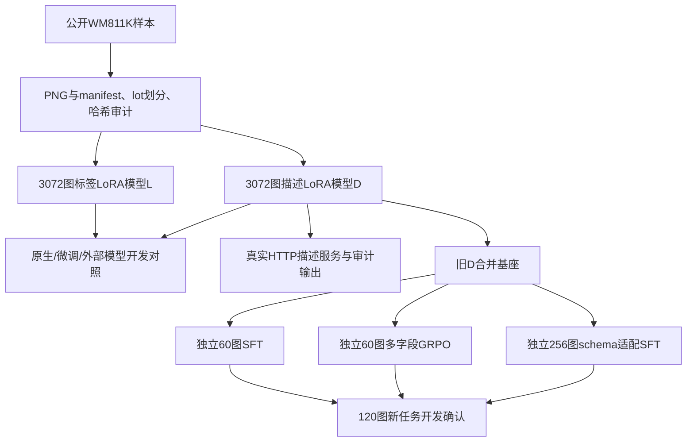

# 晶圆缺陷多模态判读与规则奖励后训练：当前版本完整说明

截至2026-10-10。按已核文件整理，包含SFT、类别GRPO、多字段GRPO、外部模型对照和真实HTTP推理原型。当前定位是**公开数据上的研究与部署原型**，没有生产上线、专家金标或最终九类独立测试。个人姓名、学历、公司和具体职责不由项目材料推定。

## 1. 项目背景与要解决的问题

晶圆测试后，每颗晶粒（die）的测试结果可以排成二维格点图。BIN图中的空间分布具有意义：中心团块、边缘环、局部聚集或线状划痕，可能对应不同缺陷模式。单独的类别标签只能回答“像哪一类”，工程师还需要知道“主要形态、位置、方向是什么”。

项目希望用可本地运行的视觉语言模型同时提供类别、简短中文描述和结构化字段。业务用途是辅助缺陷筛查、沟通与后续程序处理；没有实际产线工时、良率或成本节省数据，不能把这个目标写成已经实现的业务收益。

研究分两条：首先检验领域微调能否提升分类和输出规范；其次把可测量的图像事实写成规则，检验奖励后训练是否比正确答案监督更有效。描述质量与类别准确率分开，避免模型只学会JSON格式就被宣称会看图。

## 2. 系统与技术路线

Qwen3.5-9B是带视觉编码器的模型，输入图片与问题，输出文本。监督微调（SFT）用示例正确答案训练模型；LoRA只学习较小的附加权重，保留大部分原模型参数。GRPO则对同一图生成多个候选，根据它们的规则奖励差异更新模型。本项目采用每图4个候选，即G=4。

训练框架为ms-swift；已接受运行使用torch2.8.0+cu128、transformers5.16.1、peft0.20.0与ms-swift4.5.3等固定版本。主要采用BF16与语言侧LoRA，rank16/alpha32/dropout0.05，视觉侧冻结；每个进程由父shell在导入torch前锁定一张GPU，核实际设备数量。不同阶段硬件与环境分列，不用“能做矩阵乘”代替真实前反向门槛。

这里M1/M2实际并未从M0继续训练，这是最新实参更正。图中关系按真实运行绘制，不按原计划补画一条没有发生的续训链。较早的类别GRPO另有真正共同起点，与这轮多字段实验不同。

## 3. 数据资产与标签来源

|资产|当前口径|
|---|---|
|公开库存|5904个唯一sample_id、5904份PNG；PNG内容SHA独特5875，存在28组重复、29个冗余记录|
|原划分|train/val/test=4721/594/589，按lot分组，跨划分lot交集0|
|L/D主训练|各3072个图像ID，对应3060个独特PNG；分别监督类别、类别加形态/描述|
|历史恢复|有4292晶圆/12876对话的服务器恢复记录；不能把对话行数当新增图像，本机未独立取回原4292文件全部复核|
|晚到候选|WorkBuddy1200图候选在3072池内，556结构化、294部分字段、350文本；不是新增1200训练图或人工gold|
|v2适配与RL池|各256图，规则开发30图，新任务开发确认120图；新四池的lot与PNG两两交集0|

公开failure_type用于类别监督与评分，模型预测和模型生成描述另记来源，不作为人工真值。历史教师标注中，部分几何字段与教师所见特征相同且定义存在问题，D3072只取公开类别、教师形态与中文描述，未采用旧radial_zone/clock_direction/size_r作可靠几何监督。形态和描述仍是模型生成的辅助标签，未经过专家审核。

公开类别none不自动表示红色失效像素数为0。它与“没有显著特定缺陷模式”的语义需要按来源理解，程序caption模板不能仅凭none就写无可见失效点。

渲染采用黑色表示晶圆外、绿色表示合格晶粒、红色表示失效晶粒，448×448无损PNG和最近邻插值。矩阵恢复后再渲染一致可以证明表示自洽，不证明缺失原始pkl对应关系唯一；非方阵拉伸和像素坐标不能解释成真实物理die尺寸。

数据质量检查包括ID/lot/图片内容重复、字段来源、缺字段、重复JSON键与指纹链。早期检查器曾用空val/test集合检查交集，后来改用完整manifest并加非空和合成冲突检查。lot隔离并不保证图像内容完全隔离：36图开发比较中有1张PNG与训练PNG相同，另给35图敏感性分析，不悄悄删主表。

## 4. 监督训练：类别和描述分开建模

标签模型L以类别答案训练，描述模型D额外学习形态与中文caption。它们不是“同一个模型同时具有所有最好指标”。3072训练数据保留同输入/题面与不同监督目标的来源记录；图像只连到模型输入，真值与几何参考放在监督/离线评分侧。

训练前检查实际模板、图像token、assistant监督掩码与可训练模块；问题和视觉token不进入答案损失。参数名中出现vision或配置里freeze=true并不证明冻结，使用实际模块与LoRA配置核验。曾发现Python API传字符串all-linear与传列表的冻结行为不同，因此使用列表并记录实际目标模块；不能把该边界外推成所有CLI调用均有问题。

不同规模/种子阶段已有运行。每规模跑满1epoch同时改变图数与样本呈现次数，不能把规模曲线当纯数据量因果证据，也不只拿最佳checkpoint代表所有运行。

### 56图七类候选上的同题成绩

|模型|类别字段独立口径|完整schema门控口径|
|---|---|---|
|原生9B|15/56=26.8%|15/56=26.8%|
|L标签模型|47/56=83.9%，Macro-F1=0.8491|46/56=82.1%，Macro-F1=0.8386|
|D描述模型|43/56=76.8%，Macro-F1=0.7646|43/56=76.8%，Macro-F1=0.7646|

“完整schema门控”表示所有规定字段合法后才接收类别。L有一条类别正确，但radial_zone越界，因此两个口径相差一张。三模型均56/56 JSON可解析，不能把schema域越界称JSON解析失败。

该候选池七类各8图，与本轮3072的ID、lot、PNG内容交集0，但完整历史接触仍未知。它不是独立九类最终考卷。L与D差异的配对区间包含0，不能据此证明两种监督普遍孰优。

## 5. 外部模型同图比较

固定36图、同七字段题面，比较原生9B、L/D、四个百炼API候选和WorkBuddy显示GLM-5.3-Flash，共8模型。四API候选为Qwen3.8-Max快照、Qwen3.5-397B、Qwen3-VL-Plus、Kimi K3；真实后端/滚动版本与客户端采样不可得项保留。

|36图类别口径|正确数|
|---|---|
|L|32/36|
|D现场HTTP回答|25/36|
|Qwen3.8-Max|19/36|
|Kimi K3|14/36|
|客户端GLM|11/36|
|原生9B|6/36|
|Qwen3-VL-Plus|5/36|
|Qwen3.5-397B|严格口径0/36；统一围栏诊断8/36|

API共144次尝试、132正常返回、12连接层失败，失败保留、未自动重发。格式失败、模型内容错误和连接失败不同；围栏诊断统一另列，不修原答后拿作原生格式成绩。

外部模型零样本，本项目模型见过领域标签，比较可用于选择本任务方案，但不是训练预算对齐的通用能力排名。描述用形态、位置、遗漏、断言、格式与方向适用性分项，模型复核不称人审。旧36图的描述意见偏向最强外部模型，未证明小模型整体达到旗舰水平；后续12图caption抽查也有混合结果，没有全量描述准确率。

## 6. 两轮GRPO研究的实际关系

### 较早的类别奖励GRPO

从1440图标签模型合并后的共同R0起跑：R1继续SFT90步、R2类别GRPO90步，使用同90图顺序，GRPO G=4，SFT每图4行匹配样本呈现。只奖励公开类别正确，保存90组×4候选的实际ID与答案审计。

旧val84开发集：R0=71/84，R1=73/84，R2=75/84。R2比匹配SFT多2条只是点估计，没有统计显著性证明。这是类别技术探索，不能移用到描述模型或新120图多字段成绩。

### 多字段规则GRPO v2

将字段限制为公开类别、失效覆盖档位、红点径向质量区带、方向类型和1–12整数扇区，caption与uncertainty另列。覆盖分母为红+绿；区带表达红点分布，不把红点质心位置当缺陷区域。方向使用圆统计量并记录不适用/未知；尺寸本轮未进主奖励。

事实奖励占90%、格式最多10%；参考端决定适用性，未知参考不默认正确，模型全unknown不能刷分。几何有43项合成检查，奖励有21项反投机/接线检查；拒绝重复键、nonfinite、bool充整数、缺参考、批量长度不等。合成测试证明实现遵守定义，不能直接当专家gold。

奖励可写为：`R = 0.9 × Σ(w_j × e_j × s_j) / Σ(w_j × e_j) + 0.1 × format_score`。其中s是该字段是否相符的得分，e是参考端决定的适用掩码，w是已冻结权重；类别/覆盖/区带/方向原权重为0.30/0.20/0.20/0.20。只有未知参考被排除，已知参考下模型回答unknown仍计错。方向类型与扇区分开给分，none也是已知参考，不等于unknown。

GRPO的直觉是把4个候选的奖励减去组均值、再按组内波动缩放，使相对更好的候选更容易生成；同时用KL约束减少偏离参考策略。相同奖励缺少组内优势差异，但不保证KL项或优化器动量没有作用。奖励审计保存真实候选及分量，比只看loss下降更能判断是否接线正常。

实际三条线均从旧D合并基座新建LoRA：M0用256图适配64步；M1用60图、每图4行SFT训练60步；M2用同60图GRPO训练60步，G=4。**M1/M2没有加载M0**，所以有效匹配是M1与M2；M0是另一条适配支线。训练器args.json中adapters为空证明了这点，自己的v2_config打印意图不能代替实参。

### 120图新任务开发确认结果

|模型|类别正确数|固定8类Macro-F1（合同主指标）|覆盖全对|径向区带全对|平均规则奖励（次指标）|
|---|---|---|---|---|---|
|M0|86/120|0.6716|77/120|55/120|0.6776|
|M1|84/120|0.6519|78/120|45/120|0.6579|
|M2|83/120|0.6460|64/120|37/120|0.6060|

M2−M1主指标差−0.0060，95%配对区间[−0.0184,+0.0018]包含0，未显示类别增益。规则合规次指标差−0.0519，区间[−0.0729,−0.0322]，更低。不能用奖励合规分取代事前主指标，也不能把M0与M2的差解读为从M0续训退化。

方向拆为：正向single/axis5张（三模型均1/5）、不应给方向80张（64/65/60张完全符合）、unknown35张不计。训练60组为single5/axis1/none43/unknown11，方向权重在49/60组激活，主要训练了“不应给方向”；不是多数归零。

正式审计240条、60组、每组4回答同ID，顺序与冻结group60一致。前10与后10组是不同图片，奖励均值上涨不能独自证明记忆或过拟合；同组同分也不意味着KL项或优化器动量不会更新参数。

确认池来自原train，并与旧D训练lot有43个交集；train全量统计还参与阈值选择。因此它是开发确认，不是相对于全部模型/规则历史完全独立的最终卷。方向正向样本少、单种子、caption只有12图AI抽查，限制明确保留。

## 7. 推理原型与可恢复交付

描述模型D在单张获准RTX5090上运行。使用Python标准库http.server与ms-swift TransformersEngine，启动时加载LoRA；没有FastAPI、vLLM服务化、量化或在线热切换。

输入限定为项目标准448×448黑/绿/红PNG。接口返回类别/描述、原答与哈希、格式变更记录、needs_review及原因；结构不合法或模型不确定时保留原答，不能通过“修后答案”抬原模型成绩。needs_review是规则提示，不是经过校准的置信度。

36图真实HTTP回放：36/36成功返回，类别25/36，needs_review19/36；同客户端端到端P50=4.177秒、P95=5.376秒，峰值**已分配**显存17.88GiB。6项CPU契约覆盖坏输入、原答留存、重复键等。HTTP成功不等于内容全部正确，无并发吞吐、线上稳定性或产线效果数据。

已保存公开数据ZIP、包含服务/页面/冻结题面/检查器/36图样本的恢复启动ZIP、原答与指标、代码/环境/权重指纹。公开基座自行准备；adapter按指纹保存，不把私人配置或大权重混入公共Git。当前材料不保证服务正在在线，实例与其他项目共用时须分别协调运行与平台计费。

## 8. 能展开的工程取舍

|问题|处理与能说明的能力|
|---|---|
|lot交集检查空集恒真|加非空检查、完整manifest与合成冲突案例，不把脚本exit0当所有输入正确|
|CUDA_VISIBLE_DEVICES设置晚了|由父进程先锁卡，核实际设备与映射，纠正旧六卡运行记录|
|JSON重复键默覆盖|读取时拒绝重复键，数量/详情拆字段，保存原答及变更记录|
|冻结配置与实际参数不一致|检查真实可训练模块、adapter目标与训练器保存args；启动打印不代替实际加载|
|schema门控掩盖类别答对|类别字段口径与完整schema口径分列，避免把结构域越界说成图像识别全错|
|方向少且none与unknown混淆|参考端适用性、正向/非方向/未知分母分开，不放宽判据抬分|
|同实例另一项目仍有任务|不以GPU无进程推定实例可关机，平台关机与账单状态单独核|

## 9. 当前成果、局限与后续

当前已有真实数据链路、LoRA训练、两类GRPO、SFT匹配对照、外部模型开发比较、AI事实检查、HTTP原型与可恢复资产，足够作为研究原型项目讲述。

尚未完成：原计划M0后训练关系的纠正复跑、专家人审、九类最终独立考卷、迭代规则M3、检索训练、生产上线、证明描述整体超过最强外部模型。后续首先修适配器接线并在首次更新前验证M0权重实际载入，再研究数据规模或多种子，不能用扩大实验掩盖初始化错误。

现金实际扣费与部分历史设备区间仍未知；约1437设备分钟仅管理用暂估，不写精确实付或可确认剩余。没有新增实验结果时，不把方案预测补进简历成绩。

个人职责需要本人确认。安全的描述是参与方案、数据/结果验收与工具协作流程；是否独立开发训练/奖励代码不能由项目文件自动推定。面试主线可按“问题→数据→SFT成果→RL对照→服务出口→限制与下一步”展开。

## 10. 证据索引

|事项|来源|
|---|---|
|数量、split、ZIP及重复内容|`../自动接续_20261009/最终实物核验.json`，`../../02_ClaudeCode_实操/自动接续交付_20261009_1247/数据资产清单.md`|
|3072训练目标及数据来源|`../../02_ClaudeCode_实操/夜间扩容_20261008_0244/数据/训练数据_N3072.json`，同目录L_N3072/D_N3072.jsonl|
|56图主指标与解析分层|`../验收_20261009_56图与RL裁决/独立核验.json`|
|36图外部比较及敏感性|`../自动接续_20261009/13点补核.json`，`../../02_ClaudeCode_实操/百炼多模型业务对照_20261009_1203/`|
|旧类别90步GRPO|`../../02_ClaudeCode_实操/收尾_RL90与报告_20261006/阶段实验报告.md`及该目录原答/奖励审计|
|多字段主指标、方向、审计|`../验收_20261009_多字段RL首轮/独立复算.json`|
|真实起点与参数更正|`../验收_20261009_多字段RL首轮/起点实参核验_20261010.json`、`起点更正_20261010.md`，执行方`out_v2/更正_v2/实跑件证据.json`|
|caption抽查|`../验收_20261009_多字段RL首轮/caption12_AI复核.jsonl`与阅图联系表|
|HTTP性能与实现|`../../02_ClaudeCode_实操/部署原型_20261009_0120/`，包括性能与自测/http_replay.jsonl|
|恢复包|`../自动接续_20261009/晶圆描述服务_恢复启动包.zip`与部署恢复/README.md|

以上资料按当前已核版本组织。源码仍有历史缺陷版本时，应读取更正件，不从文件名或较高分数自行推定实验血缘。
