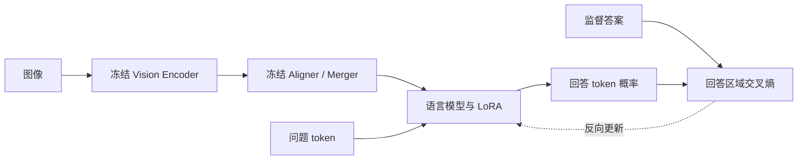

# 🎯 第一课：你的项目到底训练了什么

你已经做过训练，这节重点把训练方法、可训练参数和数值精度分开，最终能解释项目配置为什么这样设。

| 问题 | 读完应能回答 |
|---|---|
| SFT、LoRA、QLoRA 的关系 | 分别回答“学什么”“更新什么”“如何存储与计算” |
| 视觉侧冻结后怎么学看图 | 固定图像表示仍可由更新后的语言层重新解释 |
| rank 与 alpha | 能推导参数量，说明缩放系数 |
| 4-bit 为什么还占很多显存 | 权重、激活、梯度、优化器、临时内存是不同部分 |
| loss 为什么降低 | 学会监督答案的 token 分布，不保证所有任务都改善 |

## 🧩 1. 先分开三个概念

你的训练样本包含一张晶圆图、一个问题和一个目标回答。模型要提高目标回答的生成概率，这定义了本次训练的任务。至于更新多少参数、参数怎样保存，是另外两个选择。

| 概念 | 定义 | 本项目实例 |
|---|---|---|
| SFT | 用监督答案训练模型生成目标序列 | 学习类别、Caption、结构化 JSON |
| LoRA | 冻结原权重，用低秩矩阵表示可训练增量 | 语言侧 rank 16 的适配器 |
| QLoRA | 在量化冻结主干上训练 LoRA | NF4 4-bit 主干，BF16 计算 |

所以正确表达是：“用 QLoRA 做多模态 SFT。”后续 GRPO 仍然可以更新 LoRA 参数；SFT 与 GRPO 改的是训练目标，LoRA 决定更新的参数化方式。

这是功能示意图。`freeze_vit=true`、`freeze_aligner=true` 是项目使用的框架开关；精确模块边界与 LoRA 命中层需要根据固定框架和模型版本核对。

## 📐 2. LoRA 的核心公式

一个线性层原本执行输入到输出的映射。全量微调允许直接修改整个大矩阵；LoRA 把更新限制为两个小矩阵的乘积。

$$y=W_0x+\frac{\alpha}{r}BAx$$

其中，$x\in\mathbb{R}^{d_{in}}$ 是输入，$W_0\in\mathbb{R}^{d_{out}\times d_{in}}$ 是冻结权重；$A\in\mathbb{R}^{r\times d_{in}}$ 将输入投影到低维，$B\in\mathbb{R}^{d_{out}\times r}$ 再映射到输出维度。$r$ 为秩，$\alpha/r$ 为标准 LoRA 缩放系数。这是标准 LoRA 的推导，不包含 rsLoRA、DoRA 等变体。

> 💡 本项目 r=16、alpha=32，因此标准缩放系数为 2。它不是学习率，也不意味着效果会提升两倍。

### 手算参数量

假设有一个 4096×4096 的线性层。这是教学示例，不声称模型每一层都是这个尺寸。

$$N_{full}=4096^2=16,777,216$$

这是全量更新该矩阵时的参数数目。

$$N_{LoRA}=r(d_{in}+d_{out})=16(4096+4096)=131,072$$

这里两个小矩阵的参数总数为 131,072，仅为原矩阵的 1/128，约 0.78125%。这个比例针对示例中的单层，不能直接当作整个模型的可训练比例。

### rank 的意义

$BA$ 的秩至多为 $r$，因此 rank 控制这个适配增量的表达容量。rank 更高意味着更多可训练参数、梯度与优化器状态，可能拟合更多任务变化，也可能增加过拟合风险。是否更好必须通过验证集和消融判断。

训练开始时，标准 LoRA 常用一个矩阵随机初始化、另一个置零，使初始增量为零。若二者同时为零，乘积两侧的梯度都可能被另一侧的零阻断。项目实际初始化选项应查 adapter 配置，不能仅凭论文惯例认定。

## 🧊 3. 冻结了视觉侧，为何分类能改善

晶圆图先被已有视觉模型转换为表示。即使这个表示固定，语言侧仍可学习把某些视觉模式对应到 `Edge_Ring`、`Scratch` 等标签，或按指定 JSON 格式输出。

“冻结”表示不更新指定参数，不表示移除这个模块、忽略图像，或把视觉结果替换为固定文本。SFT 改进能够来自更好的领域标签映射、任务理解、回答格式与视觉信息使用方式。

但是如果视觉表示本身丢失了细小划痕或位置细节，仅训练语言侧未必足够。当前实验没有证明视觉侧就是唯一瓶颈；需排除提示词、标签定义和数据质量问题后，再做视觉侧适配消融。

## 💾 4. QLoRA 节省了什么

对于 9B 量级主干，用 BF16 每参数约 2 字节，单看权重数量级约 18 GB；若按 4 bit 估算，理想载荷约 4.5 GB。这里只估算主干参数载荷，未计量化元数据、未量化模块及运行开销，也不是本项目显存测量值。

实际训练需要保存或临时生成更多内容：

| 内存部分 | 本项目中的含义 |
|---|---|
| 冻结主干权重 | 主要线性权重以 4-bit 形式保存，仍有量化元数据与其他精度模块 |
| LoRA 参数 | 训练用的低秩矩阵，精度由实际配置和框架决定 |
| 梯度与优化器状态 | 主要针对可训练参数 |
| 激活 | 反向需要的中间结果，受图像 token、序列长度、batch 影响 |
| 临时缓冲与内存管理 | 反量化、算子工作区、缓存等 |

BF16 计算指算子所用的计算精度，不能说“全部运算都在 4 bit 上完成”。NF4 是适合相应权重分布的量化编码；double quant 进一步压缩量化常数，不是将权重再次降到 2 bit。

项目实际 SFT 报告峰值为 32.92 GiB，这与理想 4.5 GB 权重载荷不矛盾。精确显存组成还需要 profiler，不能只靠两个总量猜测。

梯度检查点用反向阶段重算部分前向结果来节省激活内存，代价是额外计算。它与权重量化解决不同部分的显存开销。

## 🎯 5. SFT 的 loss 到底要求模型学什么

一个分类样本的监督答案可能只有类别名；一个结构化样本可能包含完整 JSON。两者都可以由同一个自回归生成模型使用 token 交叉熵训练。

$$L_{SFT}=-\frac{1}{|M|}\sum_{t\in M}\log p_\theta(y_t\mid I,q,y_{<t})$$

其中，$I$ 是图像，$q$ 是问题，$y_t$ 是第 $t$ 个目标 token，$y_{<t}$ 是目标前缀，$M$ 是参与 loss 的回答位置集合。$\theta$ 在本项目主要对应可训练的 LoRA 参数。此式表达监督目标；具体跨样本和跨 batch 的归约方式由 trainer 实现决定。

训练时使用目标前缀计算后续 token 的概率，称为 teacher forcing。它与教师模型生成离线标注是两个概念。推理时看不到目标回答，需要依赖自己已经生成的前缀继续生成。

问题和图像 token 虽然通常不直接作为回答 loss 的预测目标，仍然为回答提供上下文。mask 去掉的是这些位置的直接监督，不是让模型忽略输入。必须检查实际模板的 labels mask；仅看到 `<image>` 或视觉占位符不等于已经证明 mask 正确。

本项目三类任务各有 4,292 条，不代表优化贡献严格相等。回答长度、token 难度和 loss 归约方式都会影响各任务贡献。更长的结构化答案可能贡献更多被监督的位置，需结合 trainer 实现分析。

## ⚖️ 6. 优势、局限与下一步

QLoRA 使受限资源下的领域微调可行，冻结视觉侧让首轮实验更容易控制。项目观察到分类结果明显改善，证明这条路线值得保留为基线。

**① 容量与视觉表示限制。** 低秩增量限制了可表达的权重更新。冻结视觉侧也限制了对细粒度视觉特征的重新学习。但低分不能直接归因于 rank 小或 ViT 冻结，需要先检查标签和数据，再做消融。

**② 监督目标与评测目标不完全一致。** CE 下降表示目标序列更容易预测，不保证空间尺寸更准确、检索排序更好或错误置信度更可靠。本项目尺寸 MAE 没超过恒答基线，正说明训练 loss 不能代替任务指标。数据定义错误还可能被模型学得更熟练。

**③ 量化和部署行为需要单独验证。** 量化主干与合并后的高精度模型不一定逐字输出一致。不能凭字符串一致率不足 100% 就认定合并失败，也不能只说语义接近就宣布完全等价。要结合相同任务、相同解码配置、功能指标及精度切换对照来判断。

> 🔗 后续 GRPO 试图让模型按规则奖励优化答案质量。但规则标签是否可靠、奖励是否有组内差异，会决定这一步有没有新的学习信号。

## 🎤 7. 面试表达与自测

### 30 秒回答：你怎么做的微调

“我使用 ms-swift 对 Qwen3.5-9B 做多模态 QLoRA SFT。主干采用 NF4 4-bit 量化、BF16 计算，冻结视觉编码器和 aligner，在语言侧线性层训练 rank 16、alpha 32 的 LoRA。每张训练晶圆派生分类、描述和结构化三个任务，共 12,876 条对话；单卡 micro-batch 4、梯度累积 8，按验证损失选择 checkpoint。”

### 2 分钟回答应覆盖

先交代三类生成任务和领域监督来源，再解释 CE 训练目标；接着说明 LoRA 用低秩增量减少可训练状态、QLoRA 压缩冻结主干；然后解释视觉侧冻结仍允许语言侧学习图像到领域答案的映射。最后给出项目配置、验证集选择规则以及草稿 Benchmark 的提升，补充量化显存和空间理解的实际局限。

### 三个常见追问

| 问题 | 核心回答 |
|---|---|
| LoRA 降低了模型参数总数吗？ | 基础参数仍然存在；主要减少需要更新的参数及相应梯度、优化器状态，adapter 还增加少量参数。 |
| rank 从 16 改到 32 会怎样？ | 适配参数量约翻倍；表达容量提高，但效果和显存需要实测，不能保证更好。 |
| QLoRA 的 4-bit 和 BF16 冲突吗？ | 不冲突，前者主要描述冻结权重的存储表示，后者描述相关运算的计算精度。 |

### 本轮验收题

1. 画出图像到回答 loss 的流程，并标明哪些参数更新。
2. 用自己的话解释：视觉侧冻结，为什么分类还能从 21.43% 提升到 62.30%？
3. 手算 4096×4096 线性层在 rank 16 时的 LoRA 参数量。
4. 说明 rank、alpha、learning rate 三者分别控制什么。
5. 解释为什么 4-bit 9B 模型训练仍可能占用数十 GiB 显存。
6. 如果训练 loss 下降但尺寸 MAE 没改善，给出三个可检验的假设。

能连续答清这六题，再进入 GRPO；答题过程中暴露出的概念空缺，用项目代码逐项补齐。

## 📚 8. 阅读依据

- [项目 QLoRA 训练脚本](D:/pycode/晶圆图研究/code/projects/wafer-defect-vlm/scripts/10_train_qlora.sh)
- [实际训练记录](D:/pycode/晶圆图研究/results/reports/sft_train_result.json)
- [验证损失与 checkpoint 选择](D:/pycode/晶圆图研究/results/reports/checkpoint_choice.json)
- [LoRA 论文](https://arxiv.org/abs/2106.09685)
- [QLoRA 论文](https://arxiv.org/abs/2305.14314)

公式是标准方法解释，项目数值来自本地运行产物。整模型可训练参数比例、初始化细节和精确 loss 归约未在本次阅读中重新核实，不将教学示例冒充实测配置。
