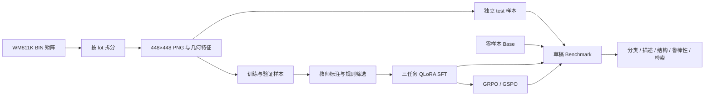
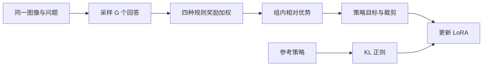

# 🎯 晶圆缺陷 VLM：面试学习路线与事实底稿

整理日期：2026-09-19。面向：做过模型训练，希望补齐 LoRA、GRPO 和评测原理的学习者。

这份材料是学习入口。已有报告保留实验历史，本文件把能够核对的事实和需要修正的解释分开。下面的第一人称项目介绍只描述项目工作；个人具体负责哪些部分，需要按真实参与情况表达。

## 🧭 1. 项目到底做了什么

晶圆 BIN 图记录每个 die 的测试状态。项目使用公开 WM811K，将离散矩阵转换成图像，让多模态模型输出缺陷类别、描述和结构化字段，并独立评估图像检索。

核心问题是：通用视觉语言模型经过领域数据 SFT 后，能否更准确地识别晶圆缺陷；继续进行规则奖励的 RL 后训练，是否带来可靠的额外收益。

教师可接收确定性几何信息；学生训练和推理接收图像与问题。分类答案来自原始可信标签，部分结构化答案来自几何规则，描述等字段来自教师。不能把全部监督统称为人工真值。

## 📦 2. 数据账目与实验事实

| 环节 | 实际数量或配置 | 面试要点 |
|---|---|---|
| 预处理 | 5,904 张唯一晶圆，3,822 个 lot | 不是把整个 WM811K 都用于训练 |
| 原始划分 | train 4,721 / val 594 / test 589 | 先按 lot 拆分，再派生任务 |
| 教师标注范围 | train + val 共 5,315 张 | test 不进入教师训练数据流程 |
| 筛选结果 | 接受 4,829，隔离 486 | 接受样本包括训练和验证 |
| 最终训练 | 4,292 张 × 3 任务 = 12,876 条 | 12,876 不是唯一图片数量 |
| 最终验证 | 537 张 × 3 任务 = 1,611 条 | 训练和验证使用不同 lot |
| 核心 Benchmark | 252 张，9 类；检索 90 个 query | Near_full 16 张，none 26 张，其余各 30 |
| 基础模型 | Qwen/Qwen3.5-9B | 原生多模态模型 |
| 框架 | ms-swift 4.6.0.dev0，固定 commit | 版本字符串之外还要保留 commit |
| SFT | 4-bit NF4 QLoRA，BF16 计算，double quant | 主干权重量化，LoRA 参数训练 |
| 适配范围 | 冻结 ViT 与 aligner，语言侧 all-linear | 冻结视觉侧仍然会利用图像 |
| LoRA | rank 16，alpha 32，dropout 0.05 | 能解释含义，不能只背数值 |
| SFT 优化 | lr 1e-4；micro-batch 4；累积 8 | 单卡有效 batch 为 32 条对话 |
| SFT 实际运行 | 604 步，约 1.5 epoch，2h11m32s | 脚本默认 300 步不等于实际运行 |
| 检查点选择 | 最低验证 loss：step 604，约 0.2800 | 没有按测试集最高分选 SFT checkpoint |
| RL | 从 SFT adapter 出发，规则奖励，150 步对照 | 包括学习率、组大小与随机种子实验 |

主教师记录混有 `deepseek-v4.1-flash` 和 `deepseek-v3.2`，次教师为 `qwen3.5-397b-a17b`。不能讲成所有样本都由同一个 DeepSeek 型号产生；现有资料也不足以把教师盲选流程描述为已完成人工验收。

## 📊 3. 可以讲的结果与限定语

| 模型 | 分类正确数 | Accuracy | Macro-F1 |
|---|---:|---:|---:|
| Base | 54 / 252 | 21.43% | 0.1347 |
| SFT | 157 / 252 | 62.30% | 0.6114 |
| GRPO，seed 3407 | 157 / 252 | 62.30% | 0.6197 |
| GRPO，seed 3408 | 153 / 252 | 60.71% | 0.5934 |
| GRPO，seed 3409 | 162 / 252 | 64.29% | 0.6211 |

上述五个 run 的分类结果已于本次阅读中从本地原始输出重新计算：每个 run 的 1,512 条请求均核对了图像文件名和 user prompt，分类 Accuracy、Macro-F1 与报告一致。绝对路径和 `images` 字段的序列化形式在服务器文件中不同，核对时统一提取图像文件名。

**最有证据的结果：SFT 相比 Base 提升 40.87 个百分点。** 后续 GRPO 的最高单次结果不能证明稳定提升。seed 3407 与 SFT 正确数相同，但错误集合并不相同：9 个样本纠正，同时另有 9 个样本变错。

检索 mAP@10：Base 0.3236，SFT 0.3873，报告中 GSPO_G32 为 0.4337。这里可以说观察到检索分数变化；没有对比学习目标，也没有足够证据把某个单次最高分表述为稳定的检索优化成果。

**所有以上结果均来自待人工双审的草稿 Benchmark。** 本次本地检查确认两份审核表各 252 行，类别填写数均为 0。`acceptance.json` 的 `all_passed: true` 包含允许 pending 的门禁，不代表人工验收完成。

## 🗂️ 4. 读代码的顺序

阅读顺序按因果链安排，先理解每步输入、输出和目的，再看实现。第一次不用逐个读历史补丁和队列脚本。

| 主题 | 入口 | 阅读时回答的问题 |
|---|---|---|
| 总结果 | [FINAL_REPORT.md](D:/pycode/晶圆图研究/docs/FINAL_REPORT.md) | 哪些改善明确，哪些仍未证实？ |
| 图像、split、几何 | [utils.py](D:/pycode/晶圆图研究/code/projects/wafer-defect-vlm/src/wafer_vlm/utils.py) | 为什么不能按对话随机拆分？ |
| 教师筛选与三任务 | [curate.py](D:/pycode/晶圆图研究/code/projects/wafer-defect-vlm/src/wafer_vlm/curate.py) | 每个字段的监督来自哪里？ |
| QLoRA 训练 | [10_train_qlora.sh](D:/pycode/晶圆图研究/code/projects/wafer-defect-vlm/scripts/10_train_qlora.sh) | 哪些参数在训练，显存花在哪里？ |
| 实际 SFT 记录 | [sft_train_result.json](D:/pycode/晶圆图研究/results/reports/sft_train_result.json) | 默认配置与实际运行有什么区别？ |
| RL 启动 | [24_train_grpo.sh](D:/pycode/晶圆图研究/code/projects/wafer-defect-vlm/scripts/24_train_grpo.sh) | rollout、旧策略、参考策略如何分工？ |
| 四个奖励 | [wafer_grpo_plugin.py](D:/pycode/晶圆图研究/code/tools/wafer_grpo_plugin.py) | 高平均奖励为什么未必有训练信号？ |
| 各项指标 | [evaluate.py](D:/pycode/晶圆图研究/code/projects/wafer-defect-vlm/src/wafer_vlm/evaluate.py) | 分母是谁，解析失败如何处理？ |
| 检索 | [retrieval_rank.py](D:/pycode/晶圆图研究/code/tools/retrieval_rank.py) | 取哪一层，池化哪些 token？ |
| 配对检验 | [paired_significance.py](D:/pycode/晶圆图研究/code/tools/paired_significance.py) | 同一批样本上如何比较两次预测？ |
| 失败分析 | [LIMITATIONS.md](D:/pycode/晶圆图研究/docs/LIMITATIONS.md) | 哪些是模型失败，哪些是标签或实验设计问题？ |

## 🧠 5. 六轮学习与验收

| 轮次 | 要学透的内容 | 达到面试水平的验收动作 |
|---|---|---|
| 1. QLoRA 与 SFT | 低秩更新、量化、冻结范围、CE、loss mask、显存 | 画出前向与反向，解释 rank/alpha，手算参数量 |
| 2. 数据与监督 | 教师筛选、几何仲裁、lot 隔离、多任务 | 追踪一张图如何生成三条训练样本 |
| 3. GRPO | rollout、组内优势、概率比、clip、KL | 手算一组奖励的优势，解释零优势问题 |
| 4. GSPO 与消融 | token/sequence 概率比、长度归一化、控制变量 | 说明实验为什么没有证明 GSPO 更优 |
| 5. 评测与检索 | Macro-F1、AP/nDCG、bootstrap、McNemar、覆盖率 | 解释指标分母，识别不公平对比 |
| 6. 模拟面试 | 两分钟介绍、连续追问、失败与改进 | 离开文档仍能用代码和结果支撑回答 |

每轮采用“你的项目实例 → 原理 → 代码 → 追问 → 你复述 → 纠错”的方式。掌握标准是能解释和迁移，不以看完多少文档为准。

第一轮从 [第一课_QLoRA与SFT.md](D:/pycode/晶圆图研究/第一课_QLoRA与SFT.md) 开始。

## 🔍 6. 面试前必须纠正的几种说法

### 6.1 “RL 奖励相同，所以完全没有梯度”

组内优势通常写为：

$$A_i=\frac{r_i-\bar r}{s_r+\epsilon}$$

其中，$r_i$ 是同一问题第 $i$ 个回答的奖励，$\bar r$ 是组内平均值，$s_r$ 是组内标准差，$\epsilon$ 防止分母为零。具体标准差及归一化实现应以固定版本 trainer 为准。

当四个回答的奖励都是 1 时，所有 $A_i$ 都为 0，奖励驱动的策略项没有区分方向。但项目设置了 `beta=0.04`，KL 正则项仍可能产生梯度；优化器状态等也可能影响参数更新。应说“缺少奖励优势信号”，不能断言整个训练步没有更新。

奖励权重实际为：类别 1.0、格式 0.2、径向 0.4、方向 0.4。格式奖励实现是七个字段的存在比例，不是严格的值类型/schema 校验；方向奖励是距离不超过一个扇区得 1，其余得 0，不是平滑距离奖励。

### 6.2 “冻结视觉编码器，所以检索向量不会变”

实际 `retrieval_rank.py` 对图像和固定英文 probe 做前向，取最后一层 hidden states，对 attention mask 有效的位置做均值池化，再 L2 归一化。这里包括有效图像和文本位置，并非直接提取冻结 ViT 的输出。

因此语言侧 LoRA 变化仍会改变检索向量。它没有经过专门的对比学习训练，不能由 SFT loss 下降直接推出检索变好。

### 6.3 “幻觉率降到零，模型就不会编造了”

`caption_metrics()` 用 `must_avoid` 关键词检查根因相关表述。0 表示这批输出未命中该词表。它无法覆盖同义改写，也不证明形态、位置、尺寸等事实全部正确。

### 6.4 “结构化分数提升，就证明学会了空间理解”

`radial_zone` 原标签由缺陷质心确定。边缘环虽然位于边缘，质心却接近圆心，导致语义不匹配。`size_r` 的 SFT MAE 约 0.4999，仍比恒答中位数的 0.1101 差。两者都不能只与 Base 比。

clock MAE 只计可转成整数的回答，SFT 为 203/250 条可解析结构化输出；Base 只计到 1/252 条。不同模型的有效子集不同，直接相减不能解释成同一总体上的改善。

### 6.5 “换三个种子，就证明算法稳定提升”

三次 GRPO 的准确率跨度为 9/252，约 3.57 个百分点。三个点可以计算描述性样本方差，但对训练随机性的总体估计仍很不稳定；文档中的“三个样本不能算方差”不宜按字面背诵。

配置记录中的 `algorithm_note`、`seed_source` 等文字差异本身不等于训练混杂。应区分真正改变训练行为的参数与记录元数据，并用实际启动参数和日志核验。当前没有充分证据得出稳定的 RL 增益结论。

### 6.6 “置信区间重叠，所以证明没有差别”

边际区间重叠不是配对差异检验。两模型在同一批图上预测，应对同一行共同重采样，或使用 McNemar 检验比较两类不一致样本。没有显著差异也不等于证明等价。

同一 lot 中可能存在相关性，当前按样本行 bootstrap 的区间不能完整代表跨 lot 泛化不确定性。后续可采用按 lot 的 cluster bootstrap。还应区分“固定训练结果的测试采样不确定性”与“换种子重训的不确定性”。

### 6.7 “代码实现了规范要求的全部指标”

规范是目标，运行产物才是当前完成状态。现有检索评分将 relevance≥1 当作二值相关，AP@K 的分母是 min(相关总数,K)，最终对 query 求平均；nDCG 使用分级相关性。代码未全面落实所有任务先按类别再宏平均，也没有提供规范里每种指标的全部置信区间。

## 🎤 7. 面试表达

### 30 秒版本

“这个项目研究晶圆 BIN 图的多模态理解。我基于公开 WM811K，建立了按 lot 隔离的数据流程，用教师模型与几何规则构造监督，对 Qwen3.5-9B 做冻结视觉侧的 QLoRA SFT，再比较 GRPO 和 GSPO。草稿基准上分类准确率从 21.43% 提升到 62.30%，但 RL 尚未体现稳定收益。项目同时检查了数据泄漏、指标口径和空间标签问题，人工双审仍待完成。”

### 2 分钟版本

“任务是让模型根据晶圆 BIN 图输出类别、描述和结构化信息。输入是离散 die 状态，统一渲染成 448×448 无损图像。相同 lot 可能共享工艺和图形特征，因此先按 lot 划分，再生成训练任务，避免同一晶圆或批次跨训练与测试。

“数据侧选出 5,904 张晶圆，仅对 train 和 val 做教师标注。通过规则校验与几何仲裁后接受 4,829 张，其中训练集 4,292 张，每张派生分类、描述和结构化三个任务，共 12,876 条训练对话。

“模型侧使用 Qwen3.5-9B 和固定版本 ms-swift。主干做 4-bit NF4 量化，冻结视觉编码器和 aligner，在语言侧使用 rank 16 的 LoRA。最终跑了 604 步，并按验证损失选择检查点。之后从 SFT adapter 出发，比较 token 级与 sequence 级重要性采样的 RL 变体，奖励来自类别、格式和几何规则。

“结果上，草稿基准分类准确率由 21.43% 提升到 62.30%。RL 的单次最好分更高，但多个种子和配对比较尚不支持稳定收益。我还发现奖励饱和会缺少组内区分信号、径向区域的质心标签与视觉语义不一致、时钟指标存在有效样本筛选。这些发现决定了下一步应优先改进标签、评测和奖励，而非单纯扩大训练。”

### 常见追问

| 追问 | 回答主线 |
|---|---|
| 为什么用多模态模型，不直接做分类器？ | 项目同时需要描述和结构化输出；若只做九类分类，轻量视觉分类器是必须补的成本与精度基线，目前不能声称 9B 最优。 |
| 为什么先做 SFT？ | 先获得能完成任务的策略，再检验规则奖励能否改善细节；当前最可靠的提升来自 SFT。 |
| 为什么 RL 没明显提升？ | 观察到格式奖励饱和、组内奖励同值、几何标签问题；这些是诊断证据，尚不足以单独确证每项的因果贡献。 |
| 为什么最高 64.29% 不直接当结论？ | 这是单个种子的点估计，不能替代跨种子平均、离散程度和配对差异检验。 |
| 下一步怎么做？ | 先完成人工审核与标签定义修订，隔离新旧 benchmark 版本，再做提示词诊断和严格控制变量的奖励消融。 |

## 📚 8. 来源与本次阅读范围

本次阅读覆盖主报告、关键局限章节、数据清单、审核状态、SFT/RL 启动脚本、数据构造、奖励、评分和检索代码；独立核对了本地样本数、图片数、ID 唯一性、lot 隔离及五个 run 的分类结果。并未逐行审计所有历史补丁，也没有在本机重跑 GPU 训练或完整评测。

已有 `acceptance.json` 记录服务器历史测试 72 passed，这不是本次本地重新运行的测试结果。本地快照没有模型权重，也没有完整的教师标注与训练中间产物；阅读足够用，完整重训还依赖服务器资料。

- [项目最终报告](D:/pycode/晶圆图研究/docs/FINAL_REPORT.md)
- [原始分类结果目录](D:/pycode/晶圆图研究/results/raw_outputs)
- [数据与审核验收记录](D:/pycode/晶圆图研究/results/reports/acceptance.json)
- [配对显著性记录](D:/pycode/晶圆图研究/results/reports/paired_significance.json)
- [Qwen3.5-9B 模型页](https://huggingface.co/Qwen/Qwen3.5-9B)
- [ms-swift 固定提交](https://github.com/modelscope/ms-swift/tree/9d3d03dd35c8a60e519e3165962586837cea67ee)

基础模型的逐层内部结构、RL trainer 的精确损失归一化和所有模块匹配情况，需要结合固定 revision 源码继续确认；本文件中的流程图表达功能关系，不替代模型源码。
